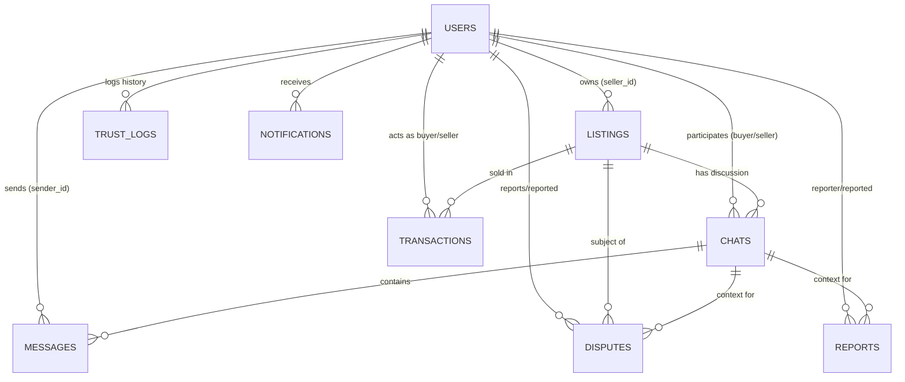
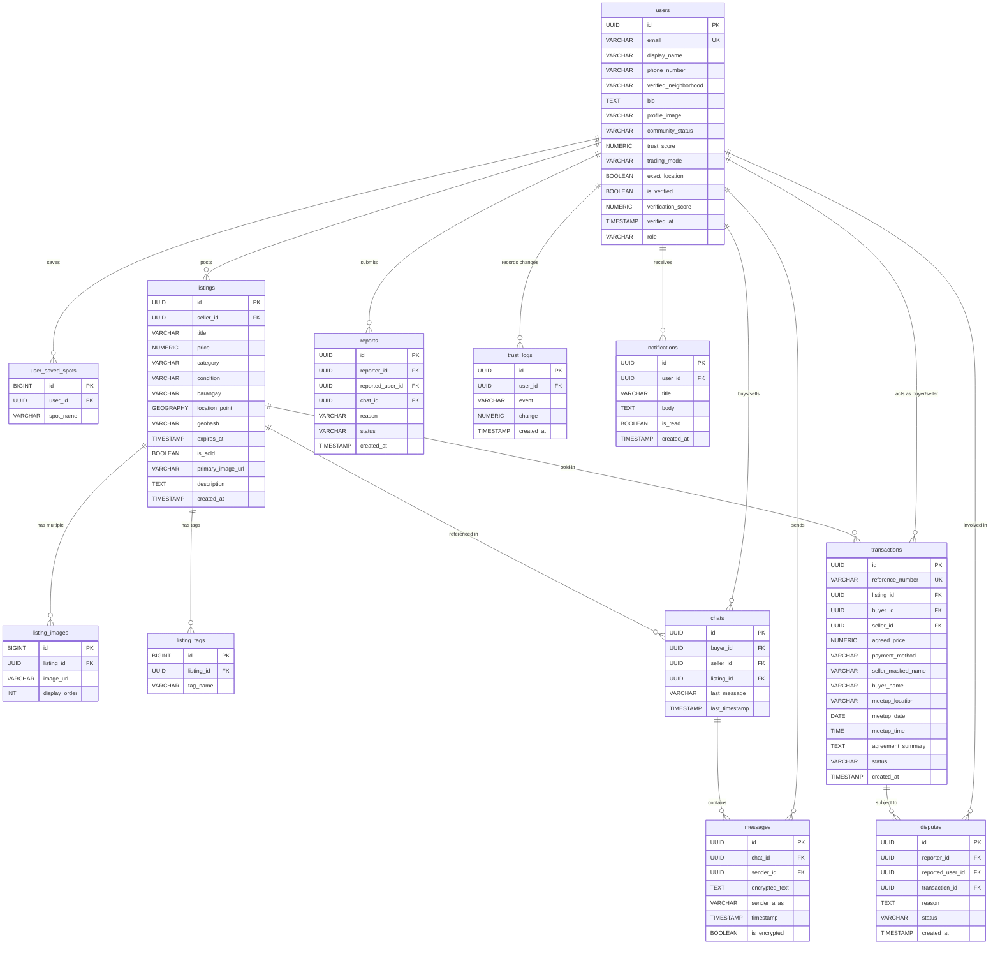
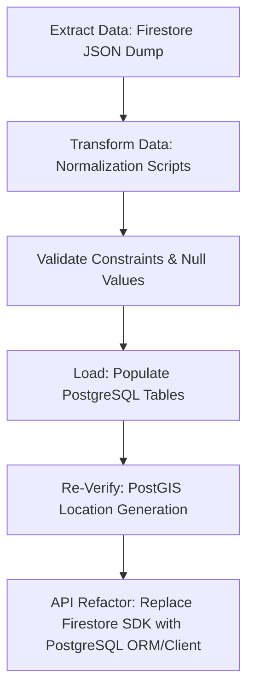

# KOMUNITRADE: Database Schema Draft & Relational Comparison
**Manuscript & Technical Project Defense Documentation**

This document provides a comparative analysis of the current NoSQL Firestore database design used in the KomuniTrade system against a proposed new Relational (SQL) database design using PostgreSQL. It maps each collection to a normalized relational structure and analyzes the trade-offs to support system design decisions.

---

## 1. Executive Comparison

| Metric / Aspect | Current Design (Cloud Firestore NoSQL) | Proposed New Design (PostgreSQL Relational SQL) |
| :--- | :--- | :--- |
| **Model Type** | Document Store (NoSQL) | Relational Database (SQL) |
| **Relationship Management** | Denormalization & Document IDs (Implicit) | Foreign Key Constraints, Joins, & Cascade Rules |
| **Data Integrity** | Checked via application code & Firestore security rules | Schema-enforced integrity (Unique, Foreign Keys, Not Null) |
| **Nested Structures** | Embedded Objects, Maps, and Sub-collections | Normalized tables, Junction tables, or JSONB columns |
| **Spatial / Geospatial Queries**| Geohash string range scans + client-side radial math | PostGIS Geography types with R-tree spatial indexing |
| **Real-time Synchronicity** | Native, out-of-the-box real-time listeners | Needs secondary services (Supabase Realtime, WebSockets) |
| **Aggregation (Stats/Admin)** | High-cost (requires document counts or manual counters) | Low-cost (highly efficient native SQL functions and indices) |

---

## 2. Entity Relationship Diagrams (ERD)

### Current NoSQL Design (Mermaid Document Representation)


### Proposed Relational SQL Design (Normalized Physical Schema)


---

## 3. Relational Database Schema DDL (PostgreSQL)

Below is the structured SQL schema implementing the new relational database structure, complete with data integrity constraints, indexes, and PostGIS geospatial extensions.

```sql
-- Enable Geospatial Extensions and UUID Generators
CREATE EXTENSION IF NOT EXISTS "uuid-ossp";
CREATE EXTENSION IF NOT EXISTS "postgis";

-- ----------------------------------------------------
-- Table: Users
-- ----------------------------------------------------
CREATE TABLE users (
    id UUID PRIMARY KEY DEFAULT uuid_generate_v4(),
    email VARCHAR(255) UNIQUE NOT NULL,
    display_name VARCHAR(100) NOT NULL,
    phone_number VARCHAR(20),
    verified_neighborhood VARCHAR(150),
    bio TEXT,
    profile_image VARCHAR(512),
    community_status VARCHAR(50) DEFAULT 'Member Badge',
    trust_score NUMERIC(5, 2) DEFAULT 80.00 CHECK (trust_score BETWEEN 0.00 AND 100.00),
    trading_mode VARCHAR(50) DEFAULT 'Both' CHECK (trading_mode IN ('Cash', 'Barter', 'Both')),
    exact_location BOOLEAN DEFAULT FALSE,
    is_verified BOOLEAN DEFAULT FALSE,
    verification_score NUMERIC(5, 2) DEFAULT 0.00,
    verified_at TIMESTAMP WITH TIME ZONE,
    role VARCHAR(20) DEFAULT 'user' CHECK (role IN ('user', 'admin')),
    created_at TIMESTAMP WITH TIME ZONE DEFAULT CURRENT_TIMESTAMP
);

-- Saved Meetup Spot Hotspots (1:M Relationship Normalized)
CREATE TABLE user_saved_spots (
    id BIGSERIAL PRIMARY KEY,
    user_id UUID NOT NULL REFERENCES users(id) ON DELETE CASCADE,
    spot_name VARCHAR(255) NOT NULL,
    UNIQUE(user_id, spot_name)
);

-- Indexing for lookup speed
CREATE INDEX idx_users_email ON users(email);
CREATE INDEX idx_users_trust ON users(trust_score);

-- ----------------------------------------------------
-- Table: Listings
-- ----------------------------------------------------
CREATE TABLE listings (
    id UUID PRIMARY KEY DEFAULT uuid_generate_v4(),
    seller_id UUID NOT NULL REFERENCES users(id) ON DELETE CASCADE,
    title VARCHAR(255) NOT NULL,
    price NUMERIC(12, 2) NOT NULL CHECK (price >= 0.00),
    category VARCHAR(100) NOT NULL,
    condition VARCHAR(50) NOT NULL CHECK (condition IN ('New', 'Like New', 'Good', 'Fair', 'Poor')),
    barangay VARCHAR(150) NOT NULL,
    -- PostGIS geography coordinate point (proves physical presence via GPS mark)
    location_point GEOGRAPHY(Point, 4326) NOT NULL, 
    geohash VARCHAR(12) NOT NULL,
    expires_at TIMESTAMP WITH TIME ZONE NOT NULL, -- TTL Expiry Date
    is_sold BOOLEAN DEFAULT FALSE,
    primary_image_url VARCHAR(512) NOT NULL,
    description TEXT,
    created_at TIMESTAMP WITH TIME ZONE DEFAULT CURRENT_TIMESTAMP
);

-- Listing Additional Photo URLs (1:M Normalized)
CREATE TABLE listing_images (
    id BIGSERIAL PRIMARY KEY,
    listing_id UUID NOT NULL REFERENCES listings(id) ON DELETE CASCADE,
    image_url VARCHAR(512) NOT NULL,
    display_order INT DEFAULT 0
);

-- Listing Search Tags (1:M Normalized)
CREATE TABLE listing_tags (
    id BIGSERIAL PRIMARY KEY,
    listing_id UUID NOT NULL REFERENCES listings(id) ON DELETE CASCADE,
    tag_name VARCHAR(100) NOT NULL,
    UNIQUE(listing_id, tag_name)
);

-- Indexes for location lookup and category searches
CREATE INDEX idx_listings_seller ON listings(seller_id);
CREATE INDEX idx_listings_geohash ON listings(geohash);
CREATE INDEX idx_listings_category ON listings(category);
CREATE INDEX idx_listings_is_sold ON listings(is_sold) WHERE is_sold = FALSE;
CREATE INDEX idx_listings_expires ON listings(expires_at);

-- PostGIS Spatial Index for radial search
CREATE INDEX idx_listings_spatial ON listings USING GIST (location_point);

-- ----------------------------------------------------
-- Table: Chats
-- ----------------------------------------------------
CREATE TABLE chats (
    id UUID PRIMARY KEY DEFAULT uuid_generate_v4(),
    buyer_id UUID NOT NULL REFERENCES users(id) ON DELETE CASCADE,
    seller_id UUID NOT NULL REFERENCES users(id) ON DELETE CASCADE,
    listing_id UUID NOT NULL REFERENCES listings(id) ON DELETE CASCADE,
    last_message TEXT,
    last_timestamp TIMESTAMP WITH TIME ZONE DEFAULT CURRENT_TIMESTAMP,
    
    -- Composite unique constraints prevent duplicate buyer-seller-item threads
    CONSTRAINT uq_chat_channel UNIQUE (buyer_id, seller_id, listing_id),
    CONSTRAINT chk_chat_parties CHECK (buyer_id <> seller_id)
);

CREATE INDEX idx_chats_participants ON chats(buyer_id, seller_id);
CREATE INDEX idx_chats_listing ON chats(listing_id);

-- ----------------------------------------------------
-- Table: Messages
-- ----------------------------------------------------
CREATE TABLE messages (
    id UUID PRIMARY KEY DEFAULT uuid_generate_v4(),
    chat_id UUID NOT NULL REFERENCES chats(id) ON DELETE CASCADE,
    sender_id UUID NOT NULL REFERENCES users(id) ON DELETE CASCADE,
    encrypted_text TEXT NOT NULL, -- ECDH P-256 + AES-GCM local key cryptogram
    sender_alias VARCHAR(100) NOT NULL,
    timestamp TIMESTAMP WITH TIME ZONE DEFAULT CURRENT_TIMESTAMP,
    is_encrypted BOOLEAN DEFAULT TRUE
);

CREATE INDEX idx_messages_chat ON messages(chat_id);
CREATE INDEX idx_messages_timestamp ON messages(timestamp ASC);

-- ----------------------------------------------------
-- Table: Transactions
-- ----------------------------------------------------
CREATE TABLE transactions (
    id UUID PRIMARY KEY DEFAULT uuid_generate_v4(),
    reference_number VARCHAR(100) UNIQUE NOT NULL, -- Receipt pattern: TRX-2026-XXXXXX
    listing_id UUID NOT NULL REFERENCES listings(id) ON DELETE RESTRICT,
    buyer_id UUID NOT NULL REFERENCES users(id) ON DELETE RESTRICT,
    seller_id UUID NOT NULL REFERENCES users(id) ON DELETE RESTRICT,
    agreed_price NUMERIC(12, 2) NOT NULL CHECK (agreed_price >= 0.00),
    payment_method VARCHAR(50) NOT NULL CHECK (payment_method IN ('Cash', 'GCash', 'Maya')),
    seller_masked_name VARCHAR(150),
    buyer_name VARCHAR(150) NOT NULL,
    meetup_location VARCHAR(255) NOT NULL,
    meetup_date DATE NOT NULL,
    meetup_time TIME NOT NULL,
    agreement_summary TEXT,
    status VARCHAR(50) DEFAULT 'Pending Agreement' 
        CHECK (status IN ('Pending Agreement', 'Confirmed', 'Completed', 'Cancelled')),
    created_at TIMESTAMP WITH TIME ZONE DEFAULT CURRENT_TIMESTAMP,
    
    CONSTRAINT chk_trx_parties CHECK (buyer_id <> seller_id)
);

CREATE INDEX idx_transactions_reference ON transactions(reference_number);
CREATE INDEX idx_transactions_parties ON transactions(buyer_id, seller_id);
CREATE INDEX idx_transactions_listing ON transactions(listing_id);

-- ----------------------------------------------------
-- Table: Disputes
-- ----------------------------------------------------
CREATE TABLE disputes (
    id UUID PRIMARY KEY DEFAULT uuid_generate_v4(),
    reporter_id UUID NOT NULL REFERENCES users(id) ON DELETE CASCADE,
    reported_user_id UUID NOT NULL REFERENCES users(id) ON DELETE CASCADE,
    transaction_id UUID NOT NULL REFERENCES transactions(id) ON DELETE CASCADE,
    reason TEXT NOT NULL,
    status VARCHAR(50) DEFAULT 'active' CHECK (status IN ('active', 'resolved', 'dismissed')),
    created_at TIMESTAMP WITH TIME ZONE DEFAULT CURRENT_TIMESTAMP,
    
    CONSTRAINT chk_dispute_parties CHECK (reporter_id <> reported_user_id)
);

-- ----------------------------------------------------
-- Table: Reports
-- ----------------------------------------------------
CREATE TABLE reports (
    id UUID PRIMARY KEY DEFAULT uuid_generate_v4(),
    reporter_id UUID NOT NULL REFERENCES users(id) ON DELETE CASCADE,
    reported_user_id UUID NOT NULL REFERENCES users(id) ON DELETE CASCADE,
    chat_id UUID NOT NULL REFERENCES chats(id) ON DELETE CASCADE,
    reason VARCHAR(100) NOT NULL,
    status VARCHAR(50) DEFAULT 'active' CHECK (status IN ('active', 'resolved')),
    created_at TIMESTAMP WITH TIME ZONE DEFAULT CURRENT_TIMESTAMP,
    
    CONSTRAINT chk_report_parties CHECK (reporter_id <> reported_user_id)
);

-- ----------------------------------------------------
-- Table: Trust Logs
-- ----------------------------------------------------
CREATE TABLE trust_logs (
    id UUID PRIMARY KEY DEFAULT uuid_generate_v4(),
    user_id UUID NOT NULL REFERENCES users(id) ON DELETE CASCADE,
    event VARCHAR(100) NOT NULL, -- e.g. 'Trade Reward', 'Report Penalty', 'Dispute Upheld'
    change NUMERIC(5, 2) NOT NULL, -- e.g. +5.00, -10.00, -15.00
    created_at TIMESTAMP WITH TIME ZONE DEFAULT CURRENT_TIMESTAMP
);

CREATE INDEX idx_trust_logs_user ON trust_logs(user_id);

-- ----------------------------------------------------
-- Table: Notifications
-- ----------------------------------------------------
CREATE TABLE notifications (
    id UUID PRIMARY KEY DEFAULT uuid_generate_v4(),
    user_id UUID NOT NULL REFERENCES users(id) ON DELETE CASCADE,
    title VARCHAR(255) NOT NULL,
    body TEXT NOT NULL,
    is_read BOOLEAN DEFAULT FALSE,
    created_at TIMESTAMP WITH TIME ZONE DEFAULT CURRENT_TIMESTAMP
);

CREATE INDEX idx_notifications_user ON notifications(user_id);
```

---

## 4. Mapping Structural Constructs

NoSQL databases represent data in hierarchical trees, whereas relational databases require flat schemas. The table below documents the architectural transition.

### 4.1 Nested Objects Mapping

#### Current NoSQL Implementation:
```json
// listings.timeMark (Embedded Map)
"timeMark": {
  "latitude": 7.0785,
  "longitude": 125.6139,
  "timestamp": 1781254800,
  "date": "2026-06-19",
  "time": "22:21:00"
}
```
#### New SQL Mapping:
Flattened into direct database columns with native spatial representation:
* `latitude` / `longitude` $\rightarrow$ Unified into a PostGIS `GEOGRAPHY(Point, 4326)` column.
* `date` & `time` $\rightarrow$ Combined into a standard `TIMESTAMP WITH TIME ZONE` or stored as separate `DATE` and `TIME` columns.

---

### 4.2 Array Fields Mapping

#### Current NoSQL Implementation:
```json
// listings.imageUrls (Array of URLs)
"imageUrls": [
  "https://firebasestorage.../image1.jpg",
  "https://firebasestorage.../image2.jpg"
]

// listings.tags (Array of Strings)
"tags": ["Electronics", "Ukay", "Davao"]
```
#### New SQL Mapping:
Mapped to distinct **Child Tables** to ensure First Normal Form (1NF) compliance:
* **Listing Images Table (`listing_images`)**: Links via `listing_id` foreign key. Includes an explicit `display_order` integer column to track primary vs. secondary images.
* **Listing Tags Table (`listing_tags`)**: Links via `listing_id` foreign key. Stores each tag as a unique row, enabling optimized indexes for filter searches.

---

### 4.3 Deterministic Key Generation mapping

#### Current NoSQL Implementation:
To prevent redundant rooms between identical buyers and sellers for the same item, Firestore determines the chat document ID using a concatenated string:
* `chatId` = `${buyerId}_${sellerId}_${itemId}`

#### New SQL Mapping:
Relational SQL enforces this pattern using database keys:
1. **Primary Key**: Generates an independent surrogate ID (`UUID`).
2. **Unique Composite Constraint**: Adds `CONSTRAINT uq_chat_channel UNIQUE (buyer_id, seller_id, listing_id)`. The relational engine rejects duplicate rows at the constraint level automatically.

---

## 5. Architectural Trade-offs & Deep Dive

### 5.1 Geospatial Engine Optimization

* **Firestore Approach**: Encodes the item's coordinates into a `geohash` string. To display nearby items, the client query scans alphabetical ranges of the hash (e.g. matching prefixes), fetches those documents, and performs manual distance calculations to prune items outside the exact circle.
* **PostgreSQL (PostGIS) Approach**: Uses true spatial indexing (R-tree over GIST index). The proximity query becomes:
  ```sql
  SELECT * FROM listings 
  WHERE ST_DWithin(location_point, ST_MakePoint(125.6139, 7.0785)::geography, 5000)
    AND is_sold = FALSE;
  ```
  This is processed natively inside the engine, bypassing string scans and client-side computational overhead.

### 5.2 Referential Integrity & Cascade Rules

* **Firestore Approach**: No database-level cascading. If an admin deletes a fraudulent seller, their active `listings`, `chats`, and pending `transactions` remain as orphans in the database unless application-level routines recursively fetch and delete them.
* **PostgreSQL Approach**: Uses foreign key cascades:
  * Deleting a `user` cascades and deletes `listings`, `chats`, `notifications`, and `reports`.
  * Deleting a `user` restricts deletion (`ON DELETE RESTRICT`) on the `transactions` table. This prevents active historical receipts and audit trails from being destroyed.

### 5.3 Data Anonymity & Privacy (E2EE chats)

* **Firestore Approach**: Message text fields are encrypted client-side using Web Crypto API. Chat IDs contain UIDs in the document path (`chats/{buyerId_sellerId_itemId}/messages`). Database read permissions are restricted in Firestore Rules by verifying if the requesting user's UID is in the `participants` array or matches the `chatId` pattern.
* **PostgreSQL Approach**: Message text is similarly encrypted. In SQL, chat privacy is validated by joins:
  ```sql
  SELECT m.* FROM messages m
  JOIN chats c ON m.chat_id = c.id
  WHERE c.id = :chat_id AND (:user_id IN (c.buyer_id, c.seller_id) OR :user_role = 'admin');
  ```
  This query is faster and easier to audit than pattern-matching strings on composite keys.

---

## 6. Migration Plan Outline (NoSQL to Relational SQL)

If migrating the production system from Firebase Firestore to PostgreSQL, the team would execute the following phases:



1. **Extract**: Dump all Firestore collections (`users`, `listings`, `chats`, `transactions`) to JSON files using a backup script.
2. **Transform**:
   - Parse embedded objects like `listings.timeMark` to columns (`latitude`, `longitude`, `timestamp`).
   - Extract arrays (`tags`, `imageUrls`, `savedSpots`) into separate relational records.
   - Map string IDs to UUID formats.
3. **Load**: Write the data sequentially to PostgreSQL, populating primary tables first (`users`, `listings`) followed by dependent tables (`chats`, `messages`, `transactions`).
4. **Deploy ORM/Client**: Replace the frontend `firebase.js` Firestore calls with API requests to a backend service running an ORM (e.g. Prisma or Sequelize) connected to PostgreSQL.
