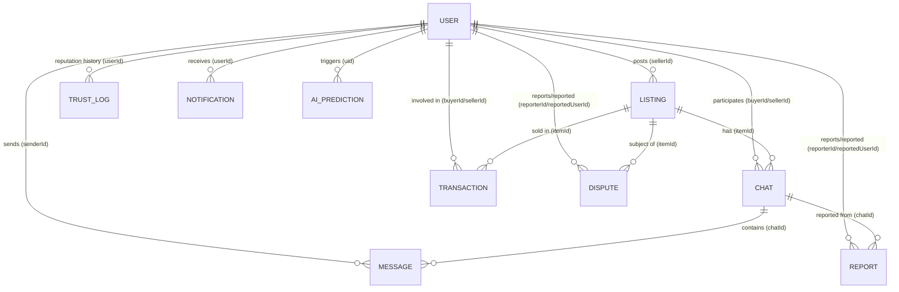

# KOMUNITRADE: Database Schema & Entity Relationship Model
**Manuscript & Project Defense Documentation**

This document contains the official technical notes for the KomuniTrade database structure, designed for use in your manuscript and project defense. It outlines the schema of the Cloud Firestore NoSQL collections, their document structures, relationships, and technical design justifications.

---

## 1. Entity Relationship Diagram (ERD)

### Relationships Explained

* **USER to LISTING (1:M)**: A user can post multiple listings, but each listing belongs to only one owner (seller).
* **USER to CHAT (1:M)**: A user can participate in multiple chats (either as a buyer or a seller).
* **USER to MESSAGE (1:M)**: A user can send multiple messages.
* **USER to TRANSACTION (1:M)**: A user can be involved in multiple transactions (as buyer or seller).
* **USER to DISPUTE/REPORT (1:M)**: A user can file or be the subject of multiple disputes or conduct reports.
* **LISTING to CHAT (1:M)**: A single listing can have multiple chat threads associated with it (different buyers interested).
* **LISTING to TRANSACTION (1:M)**: A listing is involved in a transaction (usually one successful sale).
* **CHAT to MESSAGE (1:M)**: A chat thread contains multiple messages chronologically.

---

## 2. Structural Breakdown (Firestore Collections)

KomuniTrade uses Cloud Firestore for its real-time, NoSQL database. Below are the structures of the 10 core collections.

### 2.1 Users Collection (`users`)
Stores profile, reputation, security credentials, and settings data for registered users.

| Field | Type | Description |
| :--- | :--- | :--- |
| `uid` / `id` | String (PK) | Unique User ID (from Firebase Auth) |
| `email` | String | User's registered email address |
| `displayName` | String | User's customized nickname or alias |
| `phoneNumber` | String | User's mobile contact number |
| `verifiedNeighborhood` | String | Davao Barangay where the user is verified |
| `barangay` | String | Barangay alias/copy of the neighborhood location |
| `bio` | String | User biography description |
| `profileImage` / `photoURL` | String | URL to the profile image avatar |
| `communityStatus` | String | Member badge or status level (e.g. Community Member, Elite) |
| `trustScore` | Float | Reputation rating score (0–100) based on verified trades and penalties |
| `tradingMode` | String | Default trading mode preference (Cash, Barter, or Both) |
| `savedSpots` | Array (Strings) | Saved meetup hotspot locations in Davao |
| `notificationPrefs` | Map | Boolean flags: `messages`, `priceDrops`, `reminders`, `sms` |
| `exactLocation` | Boolean | Privacy preference toggle for sharing exact GPS coordinates |
| `isVerified` / `verified` | Boolean | Flags indicating completed facial biometric verification |
| `verificationStatus` | String | Identity status: `UNVERIFIED`, `PENDING_REVIEW`, `VERIFIED`, `FAILED` |
| `verificationScore` | Float | Gemini API selfie-to-ID similarity confidence score (0–100) |
| `verifiedAt` | Timestamp | Server timestamp of biometric identity verification |
| `role` | String | User access control level: `user` or `admin` |
| `publicKeyJwk` | Map | JWK representation of the user's public key for Double Ratchet E2EE |
| `createdAt` | Timestamp | Account creation timestamp |
| `idType` | String | Extracted government ID type (e.g., Driver's License, UMID) |
| `idNumberLast4` | String | Last 4 digits of the government ID (Data Privacy Act compliance) |
| `idNameExtracted` | String | Full name extracted from the government ID by Gemini |
| `idBirthDate` | String | Birthdate extracted from the government ID |

### 2.2 Listings Collection (`listings`)
Stores hyperlocal items listed by community sellers with proof of presence and AI-generated metadata.

| Field | Type | Description |
| :--- | :--- | :--- |
| `id` | String (PK) | Unique Listing ID (Auto-generated) |
| `sellerId` | String (FK) | Unique UID of the posting seller |
| `title` | String | Custom or AI-suggested listing title |
| `price` | Float | Listing price in PHP |
| `category` | String | Product category (Electronics, Clothing, Books, Furniture, etc.) |
| `condition` | String | Quality condition scale (New, Like New, Good, Fair, Poor) |
| `barangay` | String | Barangay location of physical listing presence |
| `timeMark` | Map | Proof of presence: `latitude`, `longitude`, `timestamp`, `date`, `time` |
| `geohash` | String | Geospatial grid coordinate string for nearby filtering queries |
| `expiresAt` | Timestamp / String| TTL (Time To Live) expiration timestamp for automated auto-archiving |
| `isSold` | Boolean | Item availability status |
| `imageUrl` | String | Direct URL to the primary listing photo |
| `imageUrls` | Array (Strings) | Array of secondary uploaded photo URLs (up to 4) |
| `description` | String | Custom description or AI Tesseract OCR extracted text |
| `tags` | Array (Strings) | Array of tags generated for search optimization |
| `createdAt` | Timestamp | Listing creation timestamp |
| `aiItemName` | String | Merged CNN/OCR suggested item title |
| `aiCategory` | String | AI-suggested category from image analysis |
| `aiTags` | Array (Strings) | AI-suggested tags |
| `multiImageProcessed` | Boolean | True if multiple images were processed for this listing |

### 2.3 Chats Collection (`chats`)
Stores conversation threads between buyers and sellers, indexed deterministically to prevent duplicate channels.

| Field | Type | Description |
| :--- | :--- | :--- |
| `id` | String (PK) | Deterministic Chat ID format: `buyerId_sellerId_itemId` |
| `participants` | Array (Strings) | Array containing buyer and seller UIDs |
| `lastMessage` | String | Preview snippet of the most recent message |
| `lastTimestamp` | Timestamp | Timestamp of the last sent message |
| `itemId` | String (FK) | Reference listing ID the conversation is about |
| `itemTitle` | String | Title of the listing |
| `sellerId` | String (FK) | Seller user UID |
| `buyerId` | String (FK) | Buyer user UID |

### 2.4 Messages Sub-collection (`chats/{chatId}/messages`)
Stores real-time conversation text logs with local Double Ratchet E2EE verification.

| Field | Type | Description |
| :--- | :--- | :--- |
| `id` | String (PK) | Unique message document ID |
| `chatId` | String (FK) | Parent room Chat ID |
| `text` | String | Cryptogram encrypted client-side using ECDH P-256 + AES-GCM 256-bit |
| `senderId` | String (FK) | Sender user UID |
| `senderAlias` | String | Sender friendly alias displayed in chat bubble |
| `timestamp` | Timestamp | Date and time message was sent |
| `isEncrypted` | Boolean | True if message is encrypted (Web Crypto API) |

### 2.5 Transactions Collection (`transactions`)
Stores transaction records, meetup terms, and GCash-style receipt agreements generated upon listing purchases.

| Field | Type | Description |
| :--- | :--- | :--- |
| `id` | String (PK) | Unique transaction document ID |
| `reference_number` | String | Unique transactional receipt number (e.g. `TRX-2026-XXXXXX`) |
| `itemId` | String (FK) | Purchased listing ID |
| `item_name` | String | Title of the purchased item |
| `item_condition` | String | Product condition scale rating |
| `agreed_price` | Float | Bargained and agreed transaction price in PHP |
| `payment_method` | String | Chosen settlement method (Cash, GCash, or Maya) |
| `seller_masked_name` | String | Masked seller name to guarantee buyer privacy |
| `sellerId` | String (FK) | Seller user UID |
| `buyer_name` | String | Buyer name or custom alias |
| `buyerId` | String (FK) | Buyer user UID |
| `meetup_location` | String | Selected Davao hotspot meetup location |
| `meetup_date` | String | Scheduled meetup date |
| `meetup_time` | String | Scheduled meetup time |
| `agreement_summary` | String | Transaction agreement rules and terms summary |
| `status` | String | State: `Pending Agreement`, `Confirmed`, `Completed`, `Cancelled` |
| `created_at` | Timestamp | Date and time the transaction agreement was initiated |

### 2.6 Reports Collection (`reports`)
Stores reports submitted by users to flag bad actors during a chat.

| Field | Type | Description |
| :--- | :--- | :--- |
| `id` | String (PK) | Unique report document ID |
| `reporterId` | String (FK) | UID of the user filing the report |
| `reportedUserId` | String (FK) | UID of the user being reported |
| `chatId` | String (FK) | Deterministic Chat ID where the incident occurred |
| `reason` | String | Reason for report (e.g., Rude Behavior, Scam/Fraud, Spam, Other) |
| `timestamp` | Timestamp | Firestore server timestamp when the report was submitted |
| `status` | String | Moderation state of the report: `active` or `resolved` |

### 2.7 Disputes Collection (`disputes`)
Stores formal disputes submitted by users against transaction rules and meetup conduct.

| Field | Type | Description |
| :--- | :--- | :--- |
| `id` | String (PK) | Unique dispute document ID |
| `reporterId` | String (FK) | UID of the user filing the dispute |
| `reportedUserId` | String (FK) | UID of the user being disputed |
| `transactionId` | String (FK) | Reference transaction ID where the violation happened |
| `reason` | String | Detailed description of the violation (e.g., No Show, Fake Payment) |
| `status` | String | State: `active`, `resolved` (upheld), or `dismissed` |
| `createdAt` | Timestamp | Creation timestamp |

### 2.8 Trust Logs Collection (`trust_logs`)
Stores the timeline log of all changes to user trust scores, providing audit records for reputation progression.

| Field | Type | Description |
| :--- | :--- | :--- |
| `id` | String (PK) | Unique log ID |
| `uid` / `userId` | String (FK) | Target user UID |
| `event` | String | Event description (e.g., Trade Reward, Report Penalty, Dispute Upheld) |
| `change` | Float | Reputation points added or subtracted (e.g. `+5.00`, `-10.00`, `-15.00`) |
| `newScore` | Float | Resulting trust score after the modification |
| `ruleApplied` | String | Core regulatory rule applied (e.g., Verification Bonus, Rule 303 No-Show) |
| `reason` | String | Explanatory note for the transaction/conduct adjustment |
| `timestamp` / `createdAt` | Timestamp | Timestamp of log generation |

### 2.9 Notifications Collection (`notifications`)
Stores system alerts and messages pushed to users.

| Field | Type | Description |
| :--- | :--- | :--- |
| `id` | String (PK) | Unique notification ID |
| `userId` | String (FK) | Recipient user UID |
| `title` | String | Title of the notification |
| `body` | String | Body text description |
| `isRead` | Boolean | Read status indicator |
| `createdAt` | Timestamp | Timestamp of notification dispatch |

### 2.10 AI Predictions Collection (`ai_predictions`)
Stores diagnostic logs generated during CNN and OCR processing to audit AI classification performance.

| Field | Type | Description |
| :--- | :--- | :--- |
| `predictionId` | String (PK) | Unique prediction log document ID |
| `uid` | String (FK) | Requesting user UID |
| `imageUrl` | String | Analyzed photo URL |
| `imageBase64Size` | Integer | Raw base64 payload size |
| `roboflowCategory` | String | Custom detector predicted product category |
| `roboflowConfidence` | Float | Category detection confidence score (0–1) |
| `aiCategory` | String | DeepSeek suggested main category |
| `aiSubcategory` | String | DeepSeek suggested subcategory |
| `aiTitle` | String | DeepSeek suggested item title |
| `aiTags` | Array (Strings) | DeepSeek suggested search tags |
| `ocrText` | String | Tesseract/Google Vision raw text extracted from image |
| `confidenceNotes` | String | AI confidence feedback and details |
| `userHint` | String | Custom search/classification hint inputted by user |
| `timestamp` | Timestamp | Log entry timestamp |
| `listingId` | String (FK) | Associated listing ID (populated on successful posting) |
| `finalCategory` | String | Actual category chosen by the user on submission |
| `finalTitle` | String | Actual title chosen by the user on submission |
| `finalTags` | Array (Strings) | Actual tags chosen by the user on submission |

---

## 3. Defense Key Points & Design Justifications

* **NoSQL Document Modeling**: Chosen over relational SQL for local deployment due to seamless, real-time client notifications and synchronization (crucial for E2EE buyer-seller messaging).
* **Data Privacy Protection**: Designed around DPA (Data Privacy Act) principles:
  * Full government ID numbers are processed entirely in-memory and discarded. Only the last 4 digits (`idNumberLast4`) are committed to Firestore.
  * Real names are masked to protect participants during delivery phases (`seller_masked_name`).
* **Auditability (AI & Trust)**: The `ai_predictions` logs collect baseline data comparing suggested AI attributes against the user's final submitted listing title/tags. This allows developers to run precision, recall, and F1-score evaluation metrics locally for manuscript verification.
* **Deterministic Chats**: Deterministic keys (`buyerId_sellerId_itemId`) are utilized to restrict each item's dialogue to a single channel, preventing race conditions or duplicate chat threads in active trades.
