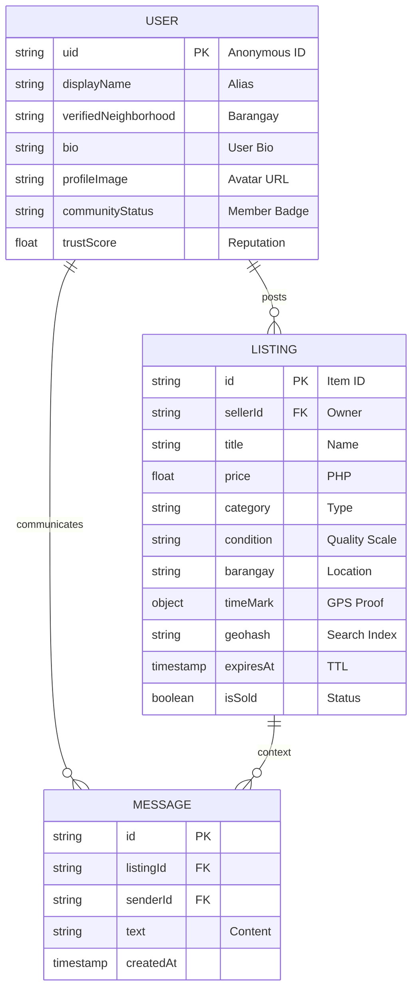

# KOMUNITRADE: Database Schema & Entity Relationship Model

This file contains the technical notes for the KomuniTrade database structure, designed for use in your manuscript and project defense.

## 1. Entity Relationship Diagram (ERD)

## 2. Structural Breakdown

### Users (Anonymous)
- **Concept**: Users remain anonymous to protect PII (Personally Identifiable Information).
- **UID**: Linked to Firebase Auth.
- **Trust Score**: A floating-point value that increases with successful neighborhood interactions.

### Listings (Hyperlocal)
- **Time Mark**: A critical technical feature for the defense. It stores the exact `lat`, `lng`, and `timestamp` when a photo was taken, proving the item is physically present in the claimed Barangay.
- **Geohash**: A base32 string representing a geographic area. Used to filter items within a specific radius without heavy SQL calculations.
- **TTL (Time-to-Live)**: The `expiresAt` field determines when a listing is automatically hidden or deleted.

### Messages (Secure)
- **Privacy**: Messages are indexed by `listingId` and `senderId` to ensure only the parties involved can access the thread.

## 3. Defense Key Points
- **NoSQL Advantage**: We use Firestore for scalability and real-time synchronization.
- **Data Privacy**: The schema is designed to function without real names, email addresses, or exact home locations.
- **Verification Proof**: The `timeMark` object is the "Digital Receipt" of a listing's authenticity.
